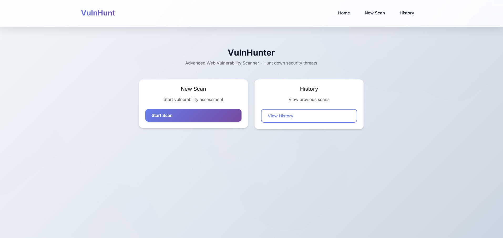
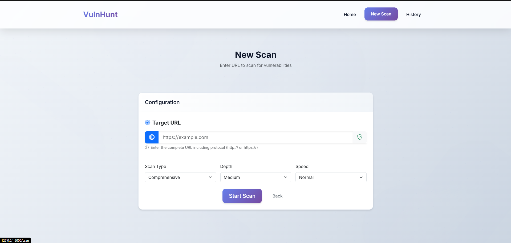
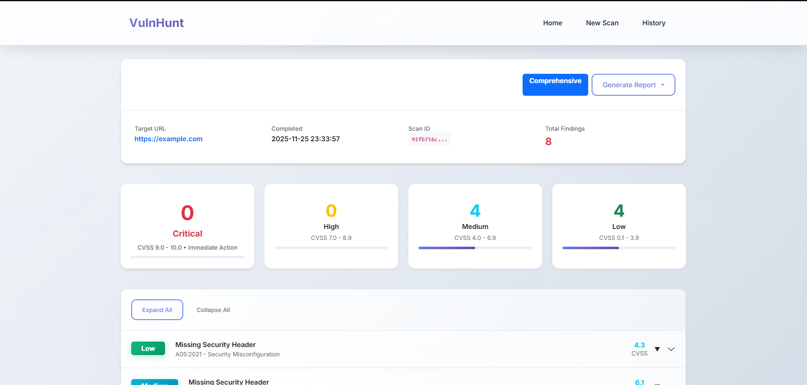

# VulnHunter - Advanced Web Vulnerability Scanner

A professional web application for comprehensive OWASP Top 10 2021 vulnerability detection with a modern, clean interface.


## 📸 Screenshots

### Home Page


### Scan Page


### Results Page


## 🛡️ Overview

This comprehensive security scanner provides automated detection of the most critical web application vulnerabilities as defined by the **OWASP Top 10 2021**. Built with Flask and featuring a clean, minimalist web interface with real-time progress tracking and professional reporting.

## ✨ Key Features

### 🔍 Complete OWASP Top 10 2021 Coverage

- **A01: Broken Access Control** - Directory traversal, privilege escalation, force browsing
- **A02: Cryptographic Failures** - Weak SSL/TLS, insecure protocols, encryption issues
- **A03: Injection** - SQL injection, XSS (reflected & stored), command injection
- **A04: Insecure Design** - Missing security controls, design flaws
- **A05: Security Misconfiguration** - Missing headers, default configs, verbose errors
- **A06: Vulnerable Components** - Outdated libraries, vulnerable dependencies
- **A07: Authentication Failures** - Weak passwords, session flaws, auth bypass
- **A08: Data Integrity Failures** - Insecure deserialization, CI/CD issues
- **A09: Security Logging Failures** - Missing logging, inadequate monitoring
- **A10: Server-Side Request Forgery** - SSRF, internal access, metadata exposure

### 🚀 Advanced Scanning Engine

- **Intelligent Web Crawling** - Automatic URL and form discovery
- **Multi-threaded Processing** - Background scan execution with real-time updates
- **CVSS 3.1 Scoring** - Professional vulnerability assessment with detailed vectors
- **Pattern Recognition** - Advanced regex and signature-based detection
- **Session Management** - Persistent HTTP sessions for authenticated testing
- **Comprehensive Reporting** - Detailed findings with evidence and remediation guidance


## 🔧 Quick Start

### Prerequisites
- **Python 3.7+**
- **Modern web browser**

### Installation & Setup

1. **Clone the repository:**
   ```bash
   git clone https://github.com/MABDULAHAD-HUB/VulnHunt.git
   cd VulnHunt
   ```

2. **Install dependencies:**
   ```bash
   pip install -r requirements.txt
   ```

3. **Start the application:**
   ```bash
   python app.py
   ```

4. **Open your browser:**
   ```
   http://localhost:5000
   ```

## 🚀 Usage Guide

### Web Interface Workflow

1. **Home Dashboard** - Access main navigation and quick actions
2. **Start New Scan** - Configure target URL and scan parameters
3. **Monitor Progress** - Real-time scan status with live updates
4. **Review Results** - Detailed vulnerability reports with CVSS scores
5. **Scan History** - Manage and review previous assessments


### Installation Requirements

For full report generation functionality, install additional dependencies:

```bash
# For PDF generation (cross-platform compatible)
pip install reportlab

# For Word document generation  
pip install python-docx

```

### Severity Classification

- **🔴 Critical (9.0-10.0)** - Immediate action required
- **🟠 High (7.0-8.9)** - High priority remediation
- **🟡 Medium (4.0-6.9)** - Standard remediation timeline
- **🟢 Low (0.1-3.9)** - Low priority improvements

